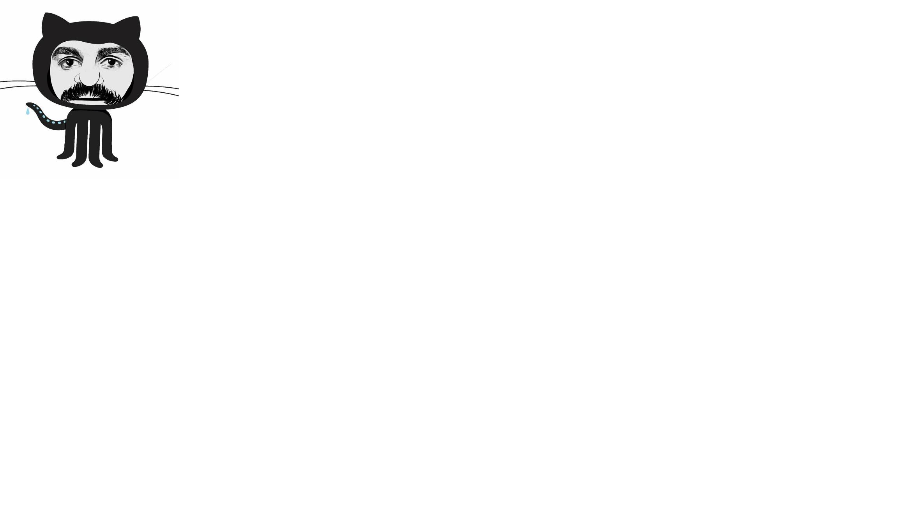

# CursoAtualDeHTML5eCSS3Modulo1

# Curso de HTML5 e CSS3

 

Material público para o ensino básico de HTML5 e CSS3 para alunos iniciantes. Acesse o material em PDF, analise o código disponibilizado para cada exercício e veja-os funcionando em execução direta via repositório GitHub.

